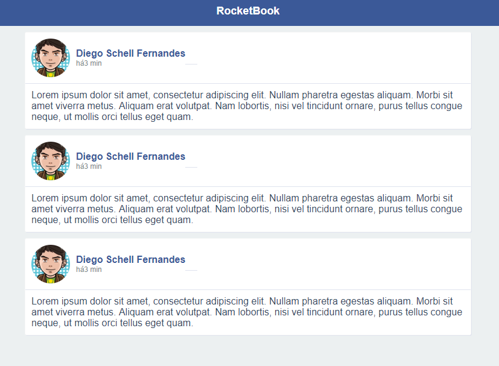

# Clone base do Facebook

Clone do layout do facebook construido com Html, Css, FlexBox e Reactjs

## Getting Started

Essas instruções farão com que você tenha uma cópia do projeto em execução na sua máquina local para fins de desenvolvimento.

### Prerequisites

```
- nodejs
- npm
```

### Installing

1° Passo: Execute os comandos abaixo para clonar o repositorio e acessar a pasta:

```
git clone https://github.com/Joaoh3326/facebook-project.git

cd facebook-project
```

2° Passo: Execute o comando abaixo para installar as depêndecias:

```
npm install ou npm i
```

4° Passo: Execute o comando para rodar em desenvolvimento localmente:

```
npm run dev
```



## Built With

- [NODEJS](https://nodejs.org/en/) - Executor de código javascript em runtime
- [NPM](https://www.npmjs.com/) - Gerenciador de pacotes
- [REACT](https://reactjs.org/) - Framework frontend para criação de webcomponents
- [ESLINT](https://eslint.org/) - Plugin utilizado para lint de código
- [WEBPACK](https://webpack.js.org/) - Bundler de código.

## Authors

- **João Henrique** - [Facebook](https://www.facebook.com/joao.nomads)

## License

This project is licensed under the MIT License - see the [LICENSE.md](LICENSE.md) file for details
